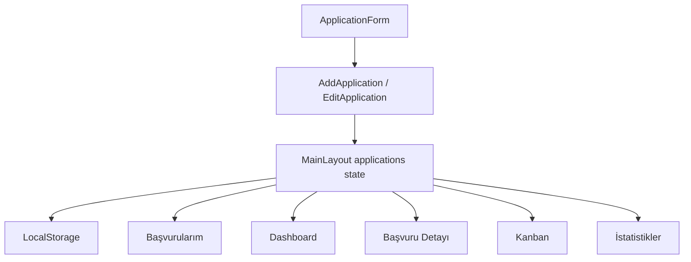

# JobTrack — İş ve Staj Başvuru Takip Platformu

## İçindekiler

- [Proje Hakkında](#proje-hakkinda)
- [Projenin Amacı](#projenin-amaci)
- [Öne Çıkan Özellikler](#one-cikan-ozellikler)
- [Sayfalar ve İşlevleri](#sayfalar-ve-islevleri)
- [Kullanılan Teknolojiler](#kullanilan-teknolojiler)
- [Uygulama Mimarisi](#uygulama-mimarisi)
- [Veri Modeli](#veri-modeli)
- [Başvuru Durumları](#basvuru-durumlari)
- [Route Yapısı](#route-yapisi)
- [Klasör Yapısı](#klasor-yapisi)
- [Kurulum ve Çalıştırma](#kurulum-ve-calistirma)
- [Kullanım](#kullanim)
- [LocalStorage Yapısı](#localstorage-yapisi)
- [Arama, Filtreleme ve Sıralama Mantığı](#arama-filtreleme-ve-siralama)
- [Kanban Sürükle-Bırak Yapısı](#kanban-surukle-birak)
- [Responsive Tasarım](#responsive-tasarim)
- [Erişilebilirlik Yaklaşımı](#erisilebilirlik)
- [Projede Kullanılan React ve JavaScript Konuları](#kullanilan-konular)
- [Teknoloji Gereksinimlerinin Karşılanması](#gereksinimlerin-karsilanmasi)
- [Sınırlamalar](#sinirlamalar)
- [Gelecekte Eklenebilecek Özellikler](#gelecek-gelistirmeler)
- [Dağıtım Notları](#dagitim-notlari)

---

## Proje Hakkında

**JobTrack**, kullanıcıların farklı şirketlere yaptıkları iş ve staj başvurularını tek bir yerde yönetebilmesini sağlayan bir başvuru takip uygulamasıdır.

Kullanıcı; başvurduğu şirketi, pozisyonu, ilan bağlantısını, başvuru tarihini, başvurunun güncel durumunu ve başvuruya ait notları kaydedebilir. Eklenen kayıtlar liste, detay sayfası, Dashboard, Kanban Board ve istatistik ekranı üzerinden takip edilebilir.

Proje yalnızca statik bir arayüz değildir. Başvuru ekleme, düzenleme, silme, durum güncelleme, arama, filtreleme, sıralama ve sürükle-bırak işlemleri ortak React state’i üzerinde çalışır. Güncel veriler `LocalStorage` içinde saklandığı için sayfa yenilendiğinde kaybolmaz.

---

## Projenin Amacı

Bu proje aşağıdaki frontend geliştirme konularını gerçek bir uygulama akışı üzerinde bir araya getirmek amacıyla geliştirilmiştir:

- React ile component tabanlı arayüz oluşturmak
- Controlled form yapısını kullanmak
- State yönetimi ve ortak veri paylaşımını uygulamak
- React Router ile çok sayfalı uygulama deneyimi oluşturmak
- JavaScript array metotlarını gerçek veriler üzerinde kullanmak
- Bootstrap componentlerini özel tasarımla birleştirmek
- LocalStorage ile backend olmadan kalıcı veri yönetmek
- HTML5 Drag and Drop API ile sürükle-bırak etkileşimi geliştirmek
- Responsive ve koyu temalı bir kullanıcı arayüzü hazırlamak

---

## Öne Çıkan Özellikler

### Başvuru Yönetimi

- Yeni iş veya staj başvurusu ekleme
- Mevcut başvuru bilgilerini düzenleme
- Başvuru detaylarını görüntüleme
- Başvuru durumunu detay sayfasından güncelleme
- Başvuruyu Bootstrap onay modalı ile silme
- Liste sayfasından doğrudan detay, düzenleme ve silme işlemleri

### Arama, Filtreleme ve Sıralama

- Şirket adına göre arama
- Pozisyon adına göre arama
- Başvuru durumuna göre filtreleme
- En yeni başvuruya göre sıralama
- En eski başvuruya göre sıralama
- Şirket adına göre alfabetik sıralama
- Arama ve filtre sonucu bulunamadığında koşullu mesaj gösterimi

### Dashboard

- Toplam başvuru sayısı
- Kaydedilen başvuru sayısı
- Başvurulan ilan sayısı
- Mülakat aşamasındaki başvuru sayısı
- Teklif alınan başvuru sayısı
- Reddedilen başvuru sayısı
- En yeni beş başvurunun listelenmesi
- Son başvurulardan detay sayfasına geçiş

### Kanban Board

- Başvuruların aşamalara göre kolonlarda gösterilmesi
- Kartların kolonlar arasında sürüklenebilmesi
- Kart bırakıldığında başvuru durumunun otomatik güncellenmesi
- Kolon bazında başvuru sayısı
- Güncellemelerin diğer sayfalara ve LocalStorage’a anında yansıması

### İstatistikler

- Toplam başvuru sayısının gösterilmesi
- Her durum için ayrı başvuru sayısı
- Durumlara göre renkli yatay grafikler
- En yüksek başvuru sayısına göre oransal bar genişliği
- Veriler değiştiğinde otomatik güncellenen istatistikler

### Kalıcı Veri

- Verilerin LocalStorage içinde saklanması
- Sayfa yenilendiğinde kayıtların korunması
- Ekleme, düzenleme, silme ve durum güncelleme işlemlerinin kalıcı olması
- LocalStorage boşsa örnek başlangıç verilerinin kullanılması
- Geçersiz JSON verisinde güvenli başlangıç verisine dönülmesi

---

## Sayfalar ve İşlevleri

### 1. Ana Sayfa

Uygulamanın tanıtım sayfasıdır.

- Hero alanı
- Başvuru ekleme ve listeleme bağlantıları
- Terminal görünümünde örnek başvuru özeti
- Dashboard, arama-filtre, Kanban ve istatistik özellik kartları
- Harici iş ilanı platformlarına yönlendiren footer bağlantıları

> Ana sayfadaki terminal ve mini istatistik alanı tanıtım amaçlı örnek içerik sunar. Gerçek zamanlı başvuru verileri Dashboard ve İstatistikler sayfasında hesaplanır.

### 2. Dashboard

Başvuru sürecinin genel durumunu özetler.

- Toplam başvuru
- Kaydedildi
- Başvuruldu
- Mülakat
- Teklif
- Reddedildi

İstatistik kartları tekrar kullanılabilir `DashboardStatCard` componenti ile oluşturulur. Kart verileri bir dizi üzerinden `map()` kullanılarak ekrana basılır. Dashboard ayrıca başvuru tarihine göre en yeni beş kaydı gösterir.

### 3. Başvuru Ekle

Yeni başvuru kaydetmek için controlled form içerir. Form alanları:

- Şirket adı
- Pozisyon
- İlan bağlantısı
- Başvuru tarihi
- Başvuru durumu
- Not

Şirket adı, pozisyon ve başvuru tarihi zorunlu alanlardır. Başvuru tarihi varsayılan olarak güncel tarihle başlar. Yeni kayıt oluşturulurken:

```js
id: crypto.randomUUID()
createdAt: new Date().toISOString()
```

değerleri eklenir.

### 4. Başvurularım

Tüm başvurular responsive Bootstrap tablo içinde gösterilir. Her kayıt için:

- Detay
- Düzenle
- Sil

işlemleri bulunur. Şirket ve pozisyon bilgileri üzerinden arama; durum üzerinden filtreleme; tarih ve şirket bilgisi üzerinden sıralama yapılabilir.

### 5. Başvuru Detayı

Dinamik route parametresi kullanılarak seçilen başvurunun bilgileri gösterilir.

- Şirket ve pozisyon
- Başvuru tarihi
- Güncel durum
- İlan bağlantısı
- Notlar
- Başvuru aşaması timeline’ı
- Durum güncelleme select’i
- Bootstrap silme modalı

URL içindeki kimlik bulunamazsa kullanıcıya “Başvuru bulunamadı” ekranı gösterilir.

### 6. Başvuruyu Düzenle

Yeni bir form kopyası oluşturmak yerine mevcut `ApplicationForm` componenti tekrar kullanılır. `initialValues` prop’u sayesinde:

- Form alanları mevcut başvuru verileriyle doldurulur.
- Kullanıcı bilgileri günceller.
- `updateApplication()` fonksiyonu ilgili kaydı `map()` ile değiştirir.
- Başvurunun mevcut `id` değeri korunur.
- Kayıt sonrasında detay sayfasına yönlendirilir.

### 7. Kanban Board

Aktif başvuru süreçleri dört kolonda gösterilir:

- Başvuruldu
- İK Görüşmesi
- Teknik Mülakat
- Teklif

`Kaydedildi` ve `Reddedildi` durumları aktif süreç kolonlarında gösterilmez; Başvurularım, Dashboard ve İstatistikler sayfalarında takip edilmeye devam eder.

### 8. İstatistikler

Her başvuru durumu için sayı hesaplanır ve yatay bar grafik olarak gösterilir. Bar genişliği şu mantıkla belirlenir:

```js
const percentage = (count / highestCount) * 100;
```

Böylece en yüksek değere sahip durum yüzde 100 genişlikte, diğer durumlar ise oransal genişlikte gösterilir.

---

## Kullanılan Teknolojiler

| Teknoloji | Kullanım Amacı |
|---|---|
| React | Component tabanlı kullanıcı arayüzü ve state yönetimi |
| Vite | Hızlı geliştirme sunucusu ve production build |
| JavaScript | Uygulama mantığı, veri işleme ve event yönetimi |
| React Router | Sayfa yönlendirmeleri ve dinamik route parametreleri |
| Bootstrap | Grid, card, table, form, button ve modal yapıları |
| CSS3 | Koyu tema, responsive düzen, hover ve geçiş efektleri |
| HTML5 | Semantik yapı, form elemanları ve Drag and Drop API |
| Lucide React | Dashboard ve özellik kartlarındaki ikonlar |
| LocalStorage | Tarayıcı tarafında kalıcı veri saklama |

---

## Uygulama Mimarisi

Uygulamanın ortak başvuru state’i `MainLayout.jsx` içinde tutulur. `MainLayout`, verileri ve işlem fonksiyonlarını `Outlet context` aracılığıyla alt route’lara aktarır:

```js
{
  applications,
  addApplication,
  deleteApplication,
  updateApplicationStatus,
  updateApplication
}
```

Alt sayfalar bu değerlere `useOutletContext()` ile erişir.

### Veri Akışı



### CRUD Akışı

```text
Ekleme
ApplicationForm → addApplication() → applications state → LocalStorage

Okuma
applications state → listeler, kartlar, detay ve istatistikler

Güncelleme
ApplicationForm / durum select’i / Kanban → map() → applications state

Silme
Bootstrap modal → deleteApplication() → filter() → applications state
```

### Neden Ortak State Kullanıldı?

Başvuru verileri yalnızca tek bir sayfayı ilgilendirmez. Aynı kayıtlar:

- Başvurularım tablosunda
- Dashboard’da
- Detay sayfasında
- Düzenleme formunda
- Kanban Board’da
- İstatistikler sayfasında

kullanılır. Bu nedenle state form componentinde veya tek bir sayfada tutulmak yerine ortak layout seviyesinde yönetilir.

---

## Veri Modeli

Her başvuru aşağıdaki yapıya sahiptir:

```js
{
  id: "application-1",
  company: "Trendyol",
  position: "Frontend Developer Intern",
  jobUrl: "https://example.com/job",
  applicationDate: "2026-07-26",
  status: "İK Görüşmesi",
  note: "Teknik görüşme için hazırlanılacak.",
  createdAt: "2026-07-26T10:00:00.000Z"
}
```

| Alan | Açıklama |
|---|---|
| `id` | Başvurunun benzersiz kimliği |
| `company` | Başvurulan şirket |
| `position` | İş veya staj pozisyonu |
| `jobUrl` | İlan bağlantısı |
| `applicationDate` | Kullanıcının seçtiği başvuru tarihi |
| `status` | Başvurunun güncel aşaması |
| `note` | Başvuruya ait kişisel not |
| `createdAt` | Kaydın uygulamaya eklendiği zaman |

Tarih, veri katmanında `YYYY-MM-DD` formatında saklanır. Liste ve Dashboard ekranında `Intl.DateTimeFormat` ile Türkçe gösterime dönüştürülür.

---

## Başvuru Durumları

Uygulamada desteklenen durumlar:

```text
Kaydedildi
Başvuruldu
İK Görüşmesi
Teknik Mülakat
Teklif
Reddedildi
```

Durum bilgileri merkezi olarak `src/data/applicationStatuses.js` dosyasında tutulur. Form, filtre, detay select’i ve istatistik ekranı aynı veri kaynağını kullanır. Bu yaklaşım, durum adlarının farklı dosyalarda farklı yazılmasını engeller.

---

## Route Yapısı

| Rota | Sayfa | Açıklama |
|---|---|---|
| `/` | Ana Sayfa | Uygulamanın tanıtım ekranı |
| `/dashboard` | Dashboard | Genel başvuru özeti |
| `/applications` | Başvurularım | Liste, arama, filtreleme ve sıralama |
| `/applications/add` | Başvuru Ekle | Yeni başvuru formu |
| `/applications/:id` | Başvuru Detayı | Seçilen başvurunun detayları |
| `/applications/:id/edit` | Başvuruyu Düzenle | Mevcut başvurunun güncellenmesi |
| `/kanban` | Kanban Board | Sürükle-bırak ile aşama yönetimi |
| `/statistics` | İstatistikler | Durum bazlı grafiksel özet |

Dinamik `:id` parametresi `useParams()` ile alınır. İlgili kayıt `find()` kullanılarak ortak başvuru dizisinde aranır.

---

## Klasör Yapısı

```text
src/
├── assets/
│   ├── hero.png
│   ├── react.svg
│   └── vite.svg
├── components/
│   ├── ApplicationForm/
│   │   ├── ApplicationForm.jsx
│   │   └── ApplicationForm.css
│   ├── FeatureCard/
│   │   ├── FeatureCard.jsx
│   │   └── FeatureCard.css
│   ├── Footer/
│   │   ├── Footer.jsx
│   │   └── Footer.css
│   ├── Logo/
│   │   ├── Logo.jsx
│   │   └── Logo.css
│   └── Navbar/
│       ├── Navbar.jsx
│       └── Navbar.css
├── data/
│   ├── applicationStatuses.js
│   ├── homeFeatures.js
│   └── initialApplications.js
├── layouts/
│   └── MainLayout.jsx
├── pages/
│   ├── AddApplication/
│   │   ├── AddApplication.jsx
│   │   └── AddApplication.css
│   ├── ApplicationDetail/
│   │   ├── ApplicationDetail.jsx
│   │   └── ApplicationDetail.css
│   ├── Applications/
│   │   ├── Applications.jsx
│   │   └── Applications.css
│   ├── dashboard/
│   │   ├── Dashboard.jsx
│   │   ├── Dashboard.css
│   │   └── DashboardStatCard.jsx
│   ├── EditApplication/
│   │   ├── EditApplication.jsx
│   │   └── EditApplication.css
│   ├── Home/
│   │   ├── Home.jsx
│   │   └── Home.css
│   ├── kanban/
│   │   ├── Kanban.jsx
│   │   └── Kanban.css
│   └── Statistics/
│       ├── Statistics.jsx
│       └── Statistics.css
├── App.jsx
├── App.css
├── index.css
└── main.jsx
```

---

## Kurulum ve Çalıştırma

### Gereksinimler

- Node.js
- npm
- Modern bir web tarayıcısı

### 1. Projeyi klonlayın

```bash
git clone <repository-url>
```

### 2. Proje klasörüne geçin

```bash
cd jobtrack
```

### 3. Bağımlılıkları yükleyin

```bash
npm install
```

### 4. Geliştirme sunucusunu başlatın

```bash
npm run dev
```

Terminalde gösterilen adresi tarayıcıda açın:

```text
http://localhost:5173
```

### Production build

```bash
npm run build
```

### Build önizleme

```bash
npm run preview
```

---

## Kullanım

1. Navbar üzerinden **Başvuru Ekle** sayfasına gidin.
2. Şirket, pozisyon, tarih ve durum bilgilerini girin.
3. **Başvuruyu Kaydet** butonuna tıklayın.
4. Yeni kayıt **Başvurularım** sayfasında görünür.
5. Arama kutusu ile şirket veya pozisyon arayın.
6. Durum select’i ile kayıtları filtreleyin.
7. Sıralama select’i ile kayıtları tarih veya şirket adına göre sıralayın.
8. **Detay** bağlantısından başvuru bilgilerini inceleyin.
9. Detay sayfasındaki select ile başvuru durumunu güncelleyin.
10. **Düzenle** bağlantısı ile mevcut bilgileri değiştirin.
11. **Sil** butonunda açılan modal üzerinden işlemi onaylayın.
12. Kanban sayfasında kartları farklı aşamalara sürükleyin.
13. Dashboard ve İstatistikler sayfalarında güncel sonuçları görüntüleyin.

---

## LocalStorage Yapısı

Başvurular aşağıdaki anahtar altında saklanır:

```text
jobtrack-applications-v1
```

LocalStorage yalnızca string değer sakladığı için kayıt sırasında:

```js
JSON.stringify(applications)
```

okuma sırasında ise:

```js
JSON.parse(storedApplications)
```

kullanılır. State başlangıcında LocalStorage kontrol edilir:

```text
Kayıt yoksa
→ initialApplications kullanılır

Geçerli kayıt varsa
→ JSON parse edilir ve uygulamaya yüklenir

Veri bozuksa
→ güvenli biçimde initialApplications kullanılır
```

`applications` state’i her değiştiğinde `useEffect` çalışır ve güncel dizi tekrar LocalStorage’a kaydedilir.

---

## Arama, Filtreleme ve Sıralama Mantığı

Başvurular sayfasındaki veri işleme sırası:

```text
applications
→ arama filtresi
→ durum filtresi
→ sıralama
→ map() ile tablo satırları
```

### Arama

Şirket ve pozisyon bilgileri birleştirilir:

```js
const searchableText =
  `${application.company} ${application.position}`
    .toLocaleLowerCase("tr-TR");
```

Arama değeri de küçük harfe dönüştürülerek `includes()` ile kontrol edilir.

### Durum filtresi

```js
if (statusFilter === "Tümü") {
  return true;
}

return application.status === statusFilter;
```

### Sıralama

- En yeni
- En eski
- Şirket adı

`sort()` mevcut diziyi değiştirdiği için önce yeni bir dizi oluşturulur:

```js
const sortedApplications = [...filteredApplications].sort(...);
```

Bu sayede React state’i doğrudan değiştirilmez.

---

## Kanban Sürükle-Bırak Yapısı

Kanban Board, HTML5 Drag and Drop API kullanır. Kullanılan temel eventler:

- `draggable`
- `onDragStart`
- `onDragOver`
- `onDrop`

### Akış

```text
Kart sürüklenir
→ applicationId dataTransfer içine yazılır
→ hedef kolon drop işlemine izin verir
→ applicationId okunur
→ updateApplicationStatus(id, newStatus) çalışır
→ kart yeni kolona taşınır
→ LocalStorage güncellenir
```

Sürüklenen kaydın kimliği:

```js
event.dataTransfer.setData(
  "applicationId",
  String(applicationId)
);
```

Hedef kolonun durumu, kaydın yeni `status` değeri olarak kullanılır.

---

## Responsive Tasarım

Proje masaüstü, tablet ve mobil ekranlara uyum sağlayacak şekilde hazırlanmıştır. Responsive davranışlar:

- Dashboard kartlarının farklı ekranlarda 1, 2, 3 veya 6 kolon olması
- Başvuru tablosunun küçük ekranlarda yatay kaydırılabilmesi
- Form alanlarının mobilde tek kolona düşmesi
- Kanban Board’un küçük ekranlarda yatay kaydırılması
- Header ve butonların mobilde alt alta yerleşmesi
- Detay ve düzenleme kartlarının ekran genişliğini aşmaması
- Footer kolonlarının küçük ekranlarda yeniden düzenlenmesi

---

## Erişilebilirlik Yaklaşımı

Projede temel erişilebilirlik uygulamaları kullanılmıştır:

- Form label’larında `htmlFor` ve input `id` eşleşmesi
- Görsel olarak gizlenen ancak ekran okuyuculara açık label’lar
- Butonlarda doğru `type` değerleri
- Modal için `aria-labelledby` ve `aria-hidden`
- Durum select’lerinde `aria-label`
- Harici bağlantılarda `rel="noreferrer"`
- İstatistik barlarında `role="progressbar"`
- Dinamik listelerde benzersiz `key` kullanımı
- Semantik `header`, `main`, `section`, `article`, `nav` ve `footer` yapıları

---

## Projede Kullanılan React ve JavaScript Konuları

### React

- Functional components
- Props
- Reusable components
- `useState`
- `useEffect`
- Controlled forms
- Form submit yönetimi
- Conditional rendering
- List rendering
- Dynamic class kullanımı
- Ortak state yönetimi
- `useOutletContext`
- `useParams`
- `useNavigate`
- React Router
- Dinamik route parametreleri

### JavaScript

- `map()`
- `filter()`
- `sort()`
- `slice()`
- `find()`
- `includes()`
- Spread operator
- Object destructuring
- Array destructuring
- Template literals
- Dynamic object properties
- Optional chaining
- Nullish coalescing
- `crypto.randomUUID()`
- `Intl.DateTimeFormat`
- `Math.max()`
- `JSON.stringify()`
- `JSON.parse()`
- LocalStorage API
- HTML5 Drag and Drop API
- Event handling

### HTML ve CSS

- Semantik HTML
- Form elemanları
- CSS Grid
- Flexbox
- CSS custom properties
- Responsive media queries
- Hover efektleri
- Transition animasyonları
- Koyu tema
- Badge tasarımları
- Responsive tablo
- Timeline tasarımı

---

## Teknoloji Gereksinimlerinin Karşılanması

| Gereksinim | Projedeki Kullanımı |
|---|---|
| HTML form | Başvuru ekleme ve düzenleme formu |
| Input, select, textarea, button | ApplicationForm componenti |
| Semantik HTML | Sayfa ve component yapıları |
| CSS hover efektleri | Kartlar, butonlar, linkler ve tablo satırları |
| CSS responsive düzen | Tüm ana sayfalarda media query kullanımı |
| Bootstrap Card | Dashboard istatistik kartları |
| Bootstrap Grid | Dashboard responsive kart düzeni |
| Bootstrap Table | Başvurularım listesi |
| Bootstrap Form | Arama ve filtre alanları |
| Bootstrap Modal | Silme onay ekranları |
| Bootstrap Button | İşlem ve yönlendirme butonları |
| JavaScript `map()` | Kart, tablo, seçenek ve grafik üretimi |
| JavaScript `filter()` | Arama, durum filtreleme ve sayım |
| JavaScript `sort()` | Tarih ve şirket sıralaması |
| LocalStorage | Kalıcı başvuru verileri |
| React component | Sayfa ve tekrar kullanılabilir UI parçaları |
| Props | ApplicationForm, FeatureCard ve DashboardStatCard |
| State | Form verileri, filtreler ve başvuru listesi |
| `useEffect` | LocalStorage senkronizasyonu |
| Conditional rendering | Boş durumlar ve bulunamadı ekranları |
| React Router | Tüm sayfa yönlendirmeleri |
| Drag and Drop | Kanban kartlarının aşamalar arasında taşınması |

---

## Sınırlamalar

- Veriler yalnızca kullanıcının tarayıcısında saklanır.
- Farklı cihazlar arasında veri senkronizasyonu yoktur.
- Kullanıcı hesabı ve kimlik doğrulama bulunmaz.
- Tarayıcı site verileri temizlenirse kayıtlar silinir.
- HTML5 Drag and Drop yapısı masaüstü kullanımına daha uygundur; mobil dokunmatik sürükleme desteği sınırlı olabilir.
- Uygulama şu an bir backend veya veritabanına bağlı değildir.

---

## Gelecekte Eklenebilecek Özellikler

- Backend ve veritabanı entegrasyonu
- Kullanıcı kayıt ve giriş sistemi
- Bulut tabanlı veri senkronizasyonu
- Başvuru durum geçmişi
- Mülakat takvimi ve hatırlatıcılar
- Toast bildirimleri
- Favori başvurular
- Tarih aralığına göre filtreleme
- Gelişmiş grafik kütüphanesi
- Başvuruları JSON veya CSV olarak dışa aktarma
- Dosyadan başvuru içe aktarma
- Mobil dokunmatik Kanban desteği
- Unit ve component testleri
- 404 sayfası
- Tema değiştirme seçeneği

---

## Dağıtım Notları

Production build oluşturmadan önce:

```bash
npm run build
```

komutunu çalıştırın.

Vercel, Netlify veya Linux tabanlı bir sunucuya dağıtım yaparken klasör adları ile import yollarındaki büyük-küçük harflerin birebir aynı olduğundan emin olun. Windows dosya sistemi büyük-küçük harf farkını çoğunlukla önemsemezken Linux ortamları önemser.

React Router kullanan statik hosting servislerinde doğrudan dinamik route’a gidildiğinde 404 alınmaması için SPA fallback yönlendirmesi yapılandırılmalıdır.

---

## Proje Durumu

Projenin aşağıdaki temel modülleri tamamlanmıştır:

- [x] Ana sayfa
- [x] Dashboard
- [x] Başvuru ekleme
- [x] Başvuru listeleme
- [x] Arama, filtreleme ve sıralama
- [x] Başvuru detay sayfası
- [x] Başvuru düzenleme
- [x] Başvuru silme
- [x] Durum güncelleme
- [x] LocalStorage
- [x] Kanban Board
- [x] Sürükle-bırak
- [x] İstatistikler
- [x] Responsive tasarım

---